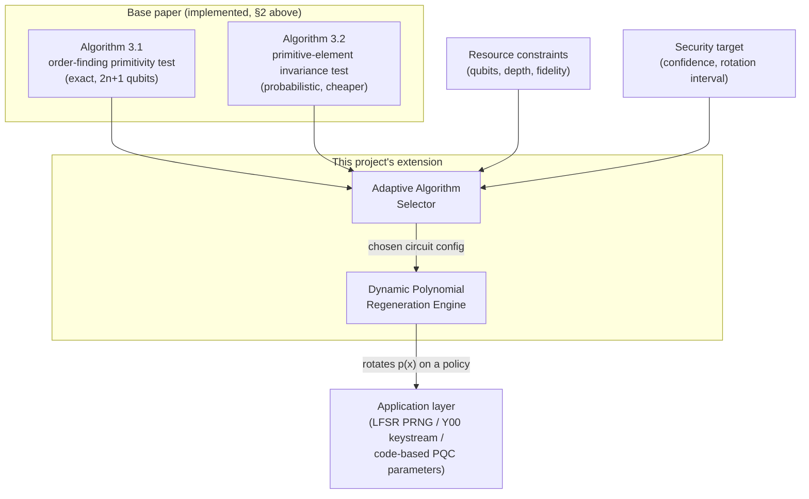
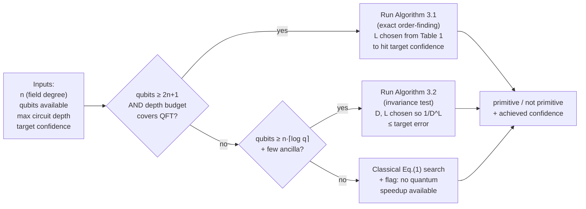

# Project Report: Adaptive Quantum Generation of Primitive Polynomials

**Extending "Quantum-Accelerated Algorithms for Generating Random Primitive
Polynomials Over Finite Fields" (Huang, Yin, Chen & Wu, *Adv. Quantum
Technol.* 2024) with resource-aware, dynamically-reconfigurable circuits**

Status: **foundation implemented and tested — adaptive extension in
active development**

---

## 1. Motivation

Huang et al. (2024) show that generating a *primitive* polynomial over a
finite field — a resource used throughout coding theory, LFSR-based
pseudo-random generation, and code-based post-quantum cryptography (PQC) —
is bottlenecked classically by the need to factor `q^n − 1`. They propose
two quantum routines that sidestep this: an order-finding primitivity test
(Algorithm 3.1) and a probabilistic primitive-element search (Algorithm
3.2). Both are described for a **fixed** field, a **fixed** circuit depth,
and implicitly assume a device that can afford the full `2n`–`2n+1`-qubit
circuit.

That's a reasonable scope for a first paper, but it leaves an open,
practically important question: **on a real, resource-constrained NISQ
device, which algorithm should you run, at what qubit/circuit-depth
budget, to meet a given security target — and how do you keep that
decision current as your device, your threat model, or your field size
changes over time?**

Two concrete gaps motivate this project:

1. **Static polynomials are a liability.** Systems that use a single fixed
   primitive polynomial for the lifetime of a protocol (LFSR seeds, Y00
   keystream generators, code-based signature parameters) expose a fixed
   target: once an adversary characterizes the polynomial's cycle
   structure, that structure never changes. Periodically **and
   unpredictably re-generating** the primitive polynomial in use —
   analogous to key rotation — shrinks the window an adversary has to
   exploit any one instance.
2. **The paper offers no resource/security dial.** Algorithm 3.1 is exact
   but needs `2n+1` qubits and a coherent QFT-depth circuit; Algorithm 3.2
   is cheaper and more noise-robust but only probabilistically correct. On
   a real backend, the right choice depends on qubits available, target
   circuit depth/fidelity, and how much confidence the application
   actually needs — none of which is fixed at design time.

This project proposes to close both gaps: **dynamic primitive-polynomial
regeneration** as a security mechanism, and an **adaptive algorithm
selector** that maps a live resource/security budget to a concrete circuit
configuration, built on top of the validated reference implementation in
this repository.

---

## 2. Foundation: what is already implemented and verified

The base of this project is
[`qprimpoly`](https://github.com/<you>/quantum-primitive-polynomials), a
from-scratch, tested Qiskit implementation of both algorithms from the
paper, specialized to `q = 2` (binary fields), with **27 passing tests**
validated against classical ground truth:

| Component | File | Paper reference |
|---|---|---|
| Classical GF(2) arithmetic + primitivity criterion | `gf2.py` | Eq. (1), §2.1 |
| GF(2)-linear multiplier circuit synthesis (generalizes `U_x` to any modulus/degree) | `linear_gf2.py` | Eq. (3)–(5), Fig. 1 |
| Order-finding primitivity test circuit + GCD post-processing | `order_finding.py` | Alg. 3.1, Fig. 2, Eq. (6)–(10) |
| Exact `N`-point inverse DFT (stand-in for the efficient approximate QFT) | `qft_exact.py` | Appendix B |
| Primitive-element invariance test | `primitive_search.py` | §3.2, Eq. (11)–(15) |

Exhaustive validation (every irreducible polynomial for `n = 3, 4, 5`, and
every field element of `F₁₆`/`F₃₂` for the invariance test) confirms exact
agreement with the paper's closed-form results, e.g. the primitive-element
detection probability `2ⁿ/(2ⁿ+2)` is reproduced to numerical precision.

This gives the project a **working, correctness-verified circuit library**
to build the adaptive layer on, rather than starting from the paper's
equations alone.

---

## 3. Proposed extension

### 3.1 Two complementary contributions



**(a) Dynamic primitive-polynomial regeneration.** Instead of fixing
`p(x)` once, the engine periodically draws a **fresh candidate**,
validates it quantumly (via whichever of Algorithm 3.1/3.2 the selector
picks), and hot-swaps it into the downstream application on a
configurable schedule or trigger (time-based, usage-count-based, or
triggered by an external compromise indicator). This directly targets
gap 1 in §1: it turns a static, analyzable target into a moving one.

**(b) Adaptive, resource-constrained algorithm selection.** A policy layer
sits in front of the two existing circuits (and the classical baseline)
and chooses, at request time:

- **which algorithm to run** — classical Eq. (1) search, Algorithm 3.2
  (invariance test), or Algorithm 3.1 (order-finding) — based on qubit
  budget and required circuit depth;
- **how many repetitions `L`** to run (Algorithm 3.1's confidence grows
  with `L`, per Table 1 of the paper: `𝒫(L) ≈ 1 − (1 − 6/π²)^{L/2}`);
- **what confidence threshold `D`** to require of Algorithm 3.2's
  probabilistic verdict (its error probability is bounded by `1/D^L`);
- **whether to fall back to the classical search entirely** when no
  quantum resource is available, while still logging the *security
  margin lost* by doing so.

This is the resource/security "dial" gap 2 called for.

### 3.2 Selector design (proposed)

The selector is a small decision procedure, not a new quantum algorithm —
its job is to turn an operating point into a circuit configuration using
the complexity results already established in §3.3 of the paper:



Pseudocode sketch of the core policy (this is the part actively being
built out on top of `qprimpoly`):

```python
def select_and_run(n, qubits_available, depth_budget, target_confidence):
    if qubits_available >= 2 * n + 1 and depth_budget >= estimate_qft_depth(n):
        L = min_L_for_confidence(target_confidence)   # from Table 1 / Eq.(10)
        return run_order_finding_test(p_bits, n, L=L)
    elif qubits_available >= n:  # + O(1) ancilla for the invariance test
        D, L = choose_D_L_for_confidence(target_confidence)  # error <= 1/D^L
        return invariance_test(alpha_bits, p_bits, n), {"D": D, "L": L}
    else:
        return search_random_primitive_polynomial(n), {"quantum_speedup": False}
```

### 3.3 Rotation policy for the dynamic engine

| Trigger | Rationale |
|---|---|
| Fixed interval (e.g. every `k` protocol sessions) | Bounds an adversary's observation window per polynomial instance |
| Usage-count threshold | Ties rotation to actual exposure rather than wall-clock time |
| Anomaly/compromise signal from the application layer | Rotates reactively, independent of schedule |
| Device/backend change (e.g. migrating between simulator and QPU, or between two IBM Quantum backends with different qubit counts) | Lets the *same* protocol keep running by re-invoking the selector with the new resource profile, instead of hard-coding one algorithm choice |

---

## 4. Evaluation plan

1. **Correctness under rotation.** Re-run the existing 27-test validation
   suite after every simulated rotation event to confirm each freshly
   drawn polynomial is independently verified primitive, not just
   assumed so.
2. **Confidence vs. cost curves.** Reproduce and extend the paper's Table
   1 (`𝒫_r(L)` vs. `L`) and the Section 3.2 `1/D^L` bound empirically
   across `n = 4..10`, to give the selector calibrated, not just
   asymptotic, thresholds.
3. **Resource-constrained backend sweep.** Run the selector against
   several simulated resource profiles (qubit counts from `n` up to
   `2n+1`, varying depth budgets) and confirm it degrades gracefully —
   correctly falling back to Algorithm 3.2 or the classical search rather
   than failing outright — and report the confidence actually delivered
   at each tier.
4. **Rotation overhead.** Measure end-to-end latency (circuit build +
   simulate/execute + classical post-processing) per rotation event at
   several `n`, to characterize how frequently rotation is practical at a
   given field size and backend.
5. **(Stretch) Hardware validation.** Run Algorithm 3.2 (the more
   noise-robust of the two, per the paper's own discussion in §4) for
   small `n` on an actual IBM Quantum backend via Qiskit Runtime, and
   compare the measured `P(all-zero)` separation between primitive and
   non-primitive candidates against the simulator predictions already
   validated in this repo.

---

## 5. Why this fits IBM Quantum / Qiskit

- Builds entirely on Qiskit primitives already used in the base repo
  (`LinearFunction` synthesis, statevector simulation, `Aer`), with a
  clear path to Qiskit Runtime for the stretch goal in §4.
- The resource-adaptive selector is exactly the kind of design pattern
  NISQ-era applications need: **the same logical task (find a primitive
  polynomial) should run differently, but correctly, on a 27-qubit
  backend, a 127-qubit backend, or a classical fallback**, and the
  application layer shouldn't have to know which.
- The dynamic-rotation angle connects a fairly abstract number-theoretic
  primitive to a concrete, motivatable security story (moving-target
  defense for LFSR/Y00 keystreams and code-based PQC parameters), which
  makes for a demonstrable, not just theoretical, project.

---

## 6. Current status and roadmap

- [x] Reference implementation of Algorithms 3.1 and 3.2, validated
      against classical ground truth (this repo, `main` branch).
- [ ] Selector policy module (`qprimpoly.adaptive`) implementing §3.2's
      decision procedure.
- [ ] Rotation engine (`qprimpoly.rotation`) with pluggable triggers from
      §3.3, wrapping an example downstream consumer (toy LFSR PRNG).
- [ ] Calibration sweep reproducing/extending Table 1 and the `1/D^L`
      bound (§4, item 2).
- [ ] Resource-constrained backend sweep + graceful-degradation report
      (§4, item 3).
- [ ] Stretch: Qiskit Runtime run on IBM Quantum hardware for small `n`.

---

## 7. References

1. S. Huang, H.-L. Yin, Z.-B. Chen, S. Wu, "Quantum-Accelerated Algorithms
   for Generating Random Primitive Polynomials Over Finite Fields," *Adv.
   Quantum Technol.* 2024, 7, 2300302.
   [doi:10.1002/qute.202300302](https://doi.org/10.1002/qute.202300302)
2. This repository's own implementation and test suite (`qprimpoly/`,
   `tests/`) — used throughout as the validated baseline this extension
   builds on.
